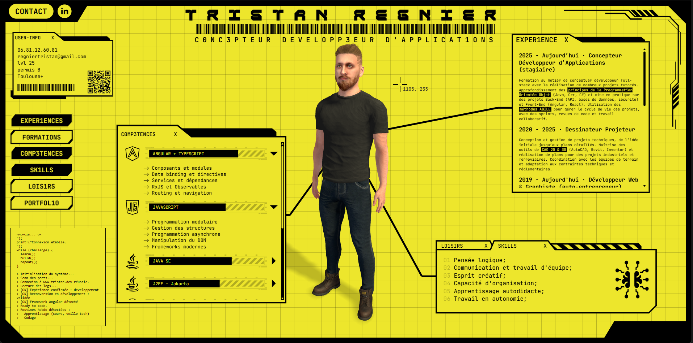

## Description

**CV interactif** développé en **Angular**, imaginé comme une interface futuriste au design **cyberpunk**.  
Ce projet présente l’ensemble des éléments de mon parcours de **Concepteur Développeur d’Applications** :  
mes **compétences techniques**, **formations**, **expériences** et **portfolio**, réunis dans une interface **dynamique et immersive**.  

Inspirée d’un **bureau virtuel**, l’application propose des **fenêtres déplaçables** (*draggable*) et une expérience visuelle soignée mêlant **design**, **interactivité** et **technologie**.

##### [Voir le site en ligne](https://tristan-lwouis.github.io/cyber_resume/)


## Aperçu

> Interface principale du CV interactif, présentant le profil 3D et les modules dynamiques.


## 🧪 Fonctionnalités principales

-  **Interface Angular dynamique** : gestion des sections via composants modulaires (expériences, formations, compétences…)
-  **Design cyberpunk** : interface jaune/noir inspirée des HUDs de science-fiction
-  **Composant 3D Avaturn** : avatar interactif et personnalisé
-  **Transitions fluides et animations SCSS**
-  **Liens dynamiques** vers LinkedIn, portfolio et contact

## ⚙️ Fonctionnalités en cours de développement

-  **Responsive design** optimisé pour desktop et tablette
-  **Animations avatar** dynamique : l'avatar bouge en fonction des éléments à l'écran


## Technologies utilisées

| Catégorie | Technologies |
|------------|--------------|
| Front-end | Angular 18, TypeScript, RxJS |
| UI/UX |  SCSS |
| Graphisme | Figma, Blender, Photoshop, Illustrator|
| 3D | Avaturn (GLB), Three.js (animation & rendu) |
| Outils | Node.js, Git, GitHub Pages |


## Installation & exécution

```bash
# 1. Cloner le projet
git clone https://github.com/<ton-pseudo>/cyber_resume.git

# 2. Se placer dans le dossier
cd cyber_resume

# 3. Installer les dépendances
npm install

# 4. Lancer le serveur local
ng serve --serve-path=/cyber_resume/

# 5. Ouvrir dans ton navigateur
http://localhost:4200/cyber_resume/

```


